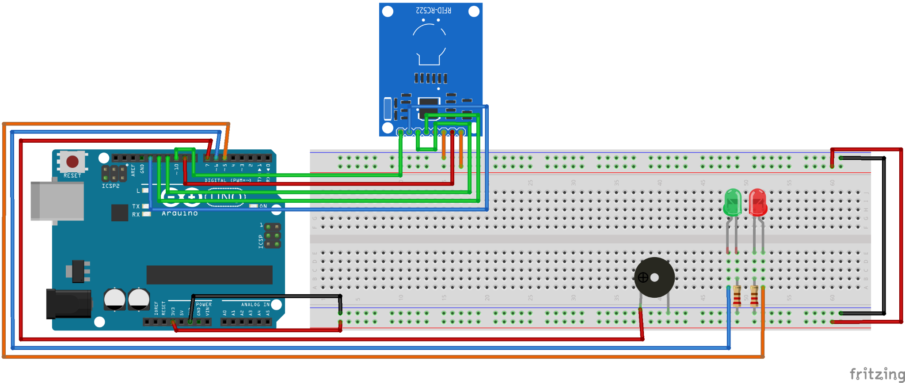
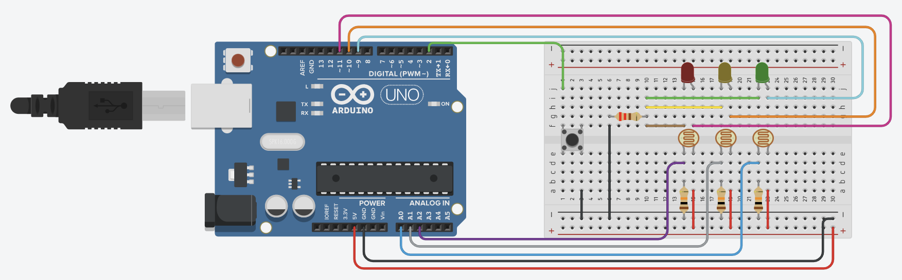
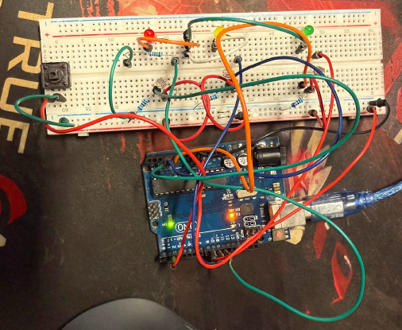

# Arduino IoT Sensor Networks

This repository contains two hands-on Internet of Things (IoT) projects developed to explore hardware-software integration, sensor data processing, and physical access control using the Arduino UNO platform.

## Project 1: Multi-Factor RFID Access Control System
*(Located in the `RFID_Access_Control` folder)*

A secure, multi-factor authentication door lock system utilizing the **MFRC522 RFID module**. 
* **Core Mechanisms:** Integrates SPI communication to read physical RFID tags and pairs it with a serial-based PIN code verification system. 
* **State Management & Roles:** Implemented an array-based local database with strict role-based access control (Admin vs. Standard User). Admins can dynamically add/remove users and reset passwords via serial commands, while the system provides real-time audio-visual feedback using LEDs and a buzzer.

## Project 2: Adaptive Smart Ambient Lighting
*(Located in the `Smart_Lighting` folder)*

<table>
  <tr>
    <td valign="top" width="50%">
      
    </td>
    <td valign="top" width="50%">
      
    </td>
  </tr>
</table>

An intelligent streetlight simulation system that dynamically adjusts LED intensity based on environmental lighting conditions.
* **Sensor Integration:** Utilized multiple Photoresistors (LDRs) connected to analog inputs to establish baseline ambient light levels and detect localized shadows or interactions.
* **Signal Processing & Control:** Employed the `map()` function to convert analog sensor readings into corresponding PWM (Pulse Width Modulation) signals for smooth LED dimming. 
* **Hardware Debouncing:** Implemented robust state-machine logic and button-debouncing techniques to seamlessly cycle through different lighting algorithms and calibration modes.

## Setup & Requirements

### Hardware Requirements
* Arduino UNO (or compatible board)
* MFRC522 RFID Module
* Photoresistors (LDR) x2
* LEDs, Buzzers, Push Buttons, and Resistors
* Breadboard and Jumper Wires

### Software & Library Installation
1. Install the latest version of the [Arduino IDE](https://www.arduino.cc/en/software).
2. For the **RFID Access Control** project, you must install the required MFRC522 library:
   * Open Arduino IDE.
   * Go to **Sketch** -> **Include Library** -> **Manage Libraries...**
   * Search for `MFRC522` (by GithubCommunity) and click **Install**.
3. Connect your Arduino board, select the correct COM port, and upload the `.ino` files to test the systems.
